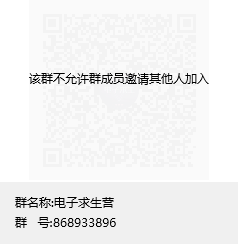

# SUSTech-EE-Course-Hero
这个仓库归档了南方科技大学本科同学电子相关课程的部分习题答案、参考资料、实验报告以及考试试卷。

鼓励各位使用本仓库的同学积极建设本仓库。

Here we archive most of the assignment answers, exam papers, lab reports, and a few review references for undergraduate courses in the Department of Electrical and Electronic Engineering.

We encourage all students who use this repo to actively build it.

# 文件结构
├─EE201-17L_模拟电路实验_Analog Circuits Laboratory  
├─EE201-17_模拟电路  
│  ├─Assignment_Answer  
│  ├─Exam_Paper  
│  └─Reference  
├─EE202-17L_数字电路实验_Digital Circuits Lab  
├─EE202-17_数字电路  
│  ├─Assignment_Answer  
│  ├─Exam_Paper  
│  └─Reference  
├─EE205_信号与系统  
│  ├─Assignment_Answer  
│  ├─Exam_Paper  
│  └─Reference  
├─EE332_数字系统设计  
├─MA212_概率论与数理统计  
│  ├─Exam_Paper  
│  │  └─概统_2020秋_quiz  
│  └─Reference  
└─SDM242_模拟电路系统设计_Analog Circuit System Design  
    └─Study_Note  

## EE202_数字电路_Digital-Circuits
### 习题答案
习题来自于国内经典教材，有对应的[习题解答册](EE202-17_数字电路/Reference/数字电子技术基础_学习辅导与习题解答_第6版_(阎石，王红编)_(z-lib.org).pdf)。
### 过往试卷
### Tips:
* 以下几个网站能够转换和简化逻辑表达式、真值表、卡诺图和Verilog：
  * [ictlab.kz/extra/Kmap](https://ictlab.kz/extra/Kmap/)
  * [charlie-coleman.com](https://charlie-coleman.com/experiments/kmap/)
  * [web.stanford.edu](https://web.stanford.edu/class/cs103/tools/truth-table-tool/)
* 卡西欧计算器可以技方便地进行进制转换、补码原码转换，具体内容参见说明书**基数计算**部分
  * [casio-fx-991cn-x说明书](https://manualzz.com/doc/50885404/casio-fx-991cn-x-%E8%AF%B4%E6%98%8E%E4%B9%A6)
# 说明 Declaration
内容来源为各QQ群文件、人传人资料等等，不能保证百分百规范，如果某部分内容侵犯了你的权益，欢迎提交issue或邮件联系我。

Content sources could be QQ group files and etc. We can not guarantee 100% specification, if any part of the content violates your rights, feel free to submit an issue or mail contact me.

# 广告 Ads
“电子求生营”是2022年3月4日建成的QQ群聊，旨在为电子系、SDIM、微电子学院的同学搭建交流平台，本仓库初始的大部分文件就来自于这个QQ群，欢迎加入。

"电子求生营" is a QQ group chat established on March 4, 2022, aiming to build a communication platform for students from the EEE, SDIM and SME, welcome to join.  

